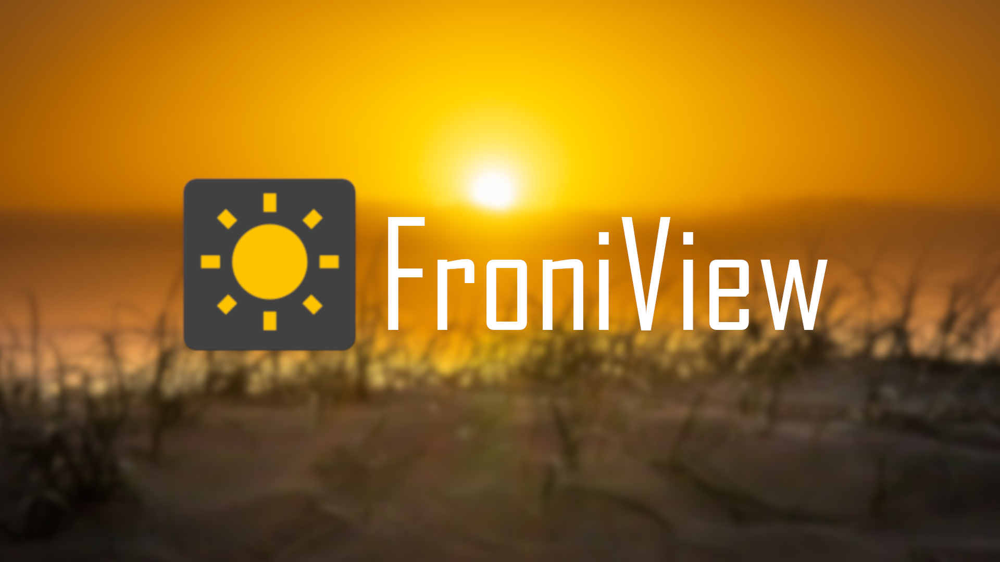

# FroniView
FroniView is an OpenSource app that allows all owners of a "Fronius" inverter to view the energy generated by the solar system without having to go through a third-party server. 

With some small changes in the backend is an use of others firm's inverters possible! 

This backend provides the data uploaded by the system function of the inverter to the "FroniView" app.

 
The API documentation is written in OpenAPI 3 and could be found in the folder "documentation".